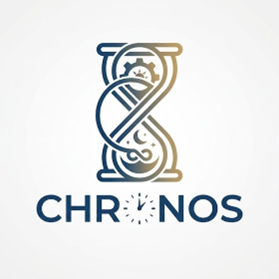

# SafeStep by Chronos

<p align="center">
  
</p>

<p align="center">
  <strong>SafeStep</strong> — Aprende primeros auxilios de forma interactiva
</p>

---

## Acerca del Proyecto

**SafeStep by Chronos** es una plataforma web interactiva desarrollada para aprender primeros auxilios a través de simulaciones realistas y gamificación. El proyecto fue creado por un equipo de estudiantes de la Universidad Peruana de Ciencias Aplicadas (UPC) como parte del curso de Desarrollo de Aplicaciones Open Source (NRC 11990), ciclo 2026-1.

El objetivo principal es democratizar el acceso a la educación en primeros auxilios, permitiendo que cualquier persona pueda aprender y practicar técnicas de emergencia de manera segura y entretenida.

---

## Estadísticas

| Métrica | Valor |
|--------|-------|
| Usuarios registrados | 50,000+ |
| Módulos de aprendizaje | 5 |
| Índice de satisfacción | 98% |
| Simulaciones disponibles | 5 |

---

## Componentes del Proyecto

| Componente | Tecnología | Descripción |
|------------|------------|-------------|
| `safestep-frontend/` | Angular 21 + Express SSR | Aplicación web principal con Server-Side Rendering |
| `safestep-backend/` | Spring Boot 4.0.5 + Java 26 | API REST para gestión de usuarios y progreso |
| `safestep-landing-page/` | HTML5 + Tailwind CSS | Página de marketing y adquisición de usuarios |
| `safestep-report/` | Markdown | Documentación académica del proyecto |
| `java-fundamentals-course-chronos/` | Java | Material educativo del curso Java |

---

## Características Principales

### Simulaciones Interactivas

- **RCP (Reanimación Cardiopulmonar)**: Practica técnicas de compresión torácica y respiración boca a boca
- **Atragantamiento**: Aprende la maniobra de Heimlich para despejar vías respiratorias
- **Quemaduras**: Protocolo de primeros auxilios para diferentes grados de quemaduras
- **Sismos**: Preparación y respuesta ante earthquakes
- **Hemorragias**: Control de sangrado y técnicas de torniquete

### Sistema de Gamificación

- **XP (Experiencia)**: Gana puntos completar módulos
- **Badges**: Insignias por logros especiales
- **Streaks**: Racha diaria de estudio
- **Leaderboard**: Tabla de posiciones entre usuarios

---

## Tech Stack

### Frontend

- Angular 21.2.0
- Express 5.1.0 (SSR)
- Tailwind CSS 4.1.12
- TypeScript 5.9.2
- Vitest (testing)

### Backend

- Spring Boot 4.0.5
- Java 26
- PostgreSQL
- Spring Security
- Maven

### Landing Page

- HTML5 semántico
- Tailwind CSS (CDN)
- Font Awesome 6.4.0
- Google Fonts (Inter, Poppins)

---

## Requisitos Previos

- Node.js 18+
- Java Development Kit (JDK) 26
- Maven 3.8+
- PostgreSQL 14+
- Git

---

## Instalación y Ejecución

### Frontend (Angular)

```bash
cd safestep-frontend
npm install
npm start
```

Acceso: http://localhost:4200

### Backend (Spring Boot)

```bash
cd safestep-backend
./mvnw spring-boot:run
```

Puerto: 8080 (por defecto)

### Landing Page

```bash
cd safestep-landing-page
# Abrir index.html en el navegador
# O usar servidor local:
python -m http.server 8000
```

Puerto: 8000

---

## Estructura del Proyecto

```
chronos/
├── java-fundamentals-course-chronos/    # Curso Java educativo
├── safestep-backend/                    # API REST (Spring Boot)
├── safestep-frontend/                   # Aplicación web (Angular)
├── safestep-landing-page/               # Página de marketing
├── safestep-report/                     # Documentación académica
└── logo.png                             # Logo del proyecto
```

---

## Equipo

Desarrollado por el equipo **Chronos** de la Universidad Peruana de Ciencias Aplicadas (UPC).

- Curso: Desarrollo de Aplicaciones Open Source (NRC 11990)
- Ciclo: 2026-1

---

## Licencia

Este proyecto es parte de un proyecto académico. Todos los derechos reservados.

---
